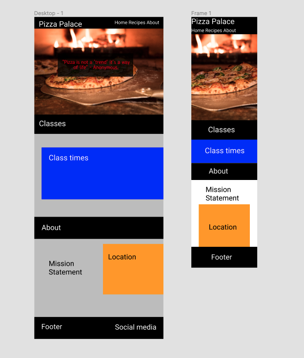
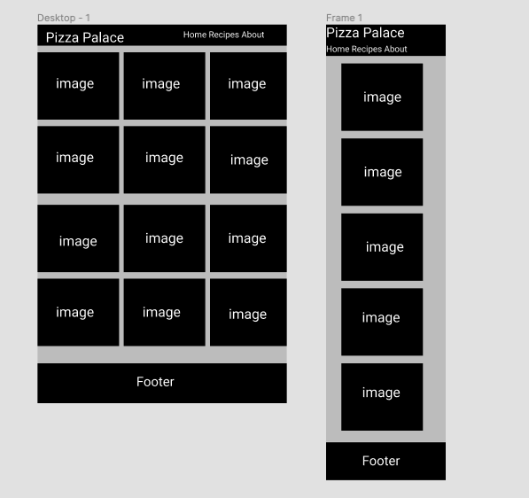
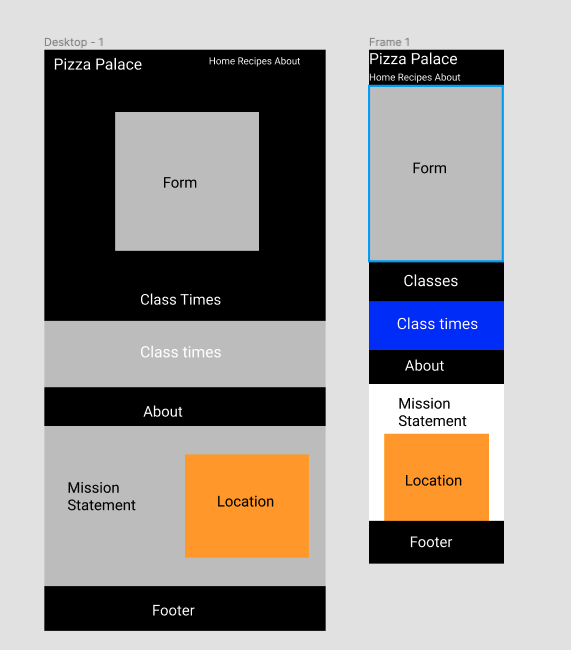
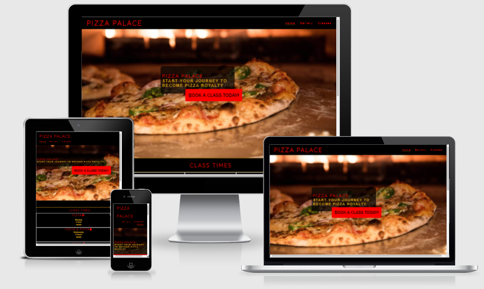
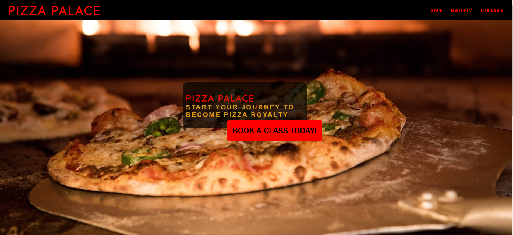
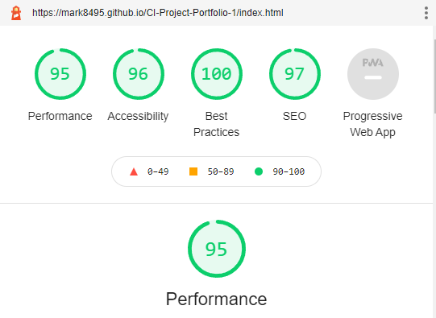
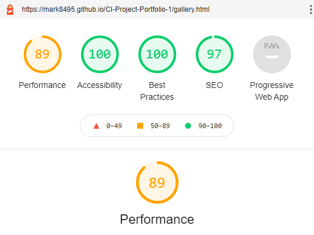
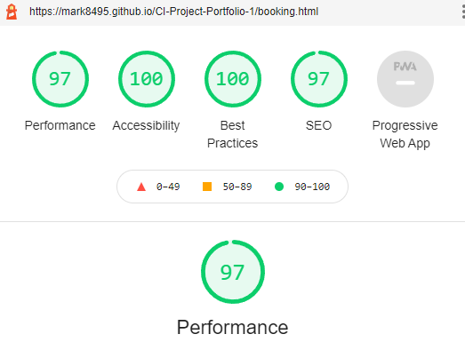

# **_Pizza Palace - Project Portfolio 1 - HTML & CSS_**
Pizza Palace is a small company that encourages users to come and take their pizza making masterclass. This site is targeted at the individuals who have not yet taken a class and are either finding the website organically through, finish this.

You can view the live site here - <a href="" target="blank" rel=noopener>Pizza Palace</a>

# Contents
- [ Objectives ](#objective)
- [User Experience](#user-experience)
    - [Design](#design)
    - [Site Structure](#site-structure)
    - [Design Choices](#design-choices)
- [Features](#features)
- [Technology](#technology)
- [Testing](#testing)
- [Deployment](#deployment)
- [Credits](#credits)

# Objective

In my first project. I wanted to develop a simple website that would be beneficial for any business to have. The main objective was to present my skills in HTMl and CSS.

# User Experience
## Design

The Design for Pizza Palace was built in [Figma](https://www.figma.com/). 

### Home Page Plan

### Gallery Page

### Booking page

## Site Structure

The website for Pizza Palace is set over four webpages with three navigations links for the user to use. The **Home** page is the default loading page. The **Gallery** has all the sample images that the business might have. Finally the **Form** page where the user can show their interest. The fourth page is where you are directed when you complete the form.

## Design Choices
I wanted the colours of the Site to stand out, so making a simple pallette that represented the colours of pizza was the way I decided to go. Focusing on Red or crust colour fonts for all scripts works well together. I chose the font Quicksand for all titles. I think the font is clean and simple.

[Back to Table of contents](#contents)

# Features
The Pizza Palace website is designed to be easy to use. It contains all the standard features that users would be familiar with. The overall feel of the website is to be as simple and straightforward as possible.

## Existing Features

### Navigation Menu
I wanted the navigation menu to be simple and intuitive. Clear and easy to use. Familiar to both new and veteran internet users.

### Home

This is the first part of the website that the User will be visiting. I wanted to make the purpose immediately clear that this website was all about Pizza.
I added a catchy slogan front and center on the page so that the User understands that this website is about helping the Users step up their game making pizzas.
Attached to the slogan is a responsive button that encouages the user to "Book Now" Clicking the button will send them to the booking page where they can sign up.

### About

The about section lets the user know about what time the classes are on, the mission statement for the business as a whole, as well as the location of where to find the classes.

### Gallery

The gallery has a layout of stock photos that would give the user a sense of what the classes entail and the benefits that they would have.
I used 

### Booking Form

I wanted the booking page to be straightforward. With a simple sign in sheet to display interest in the classes. Along with

### Footer

I wanted the footer to continue the clean layout along with the rest of the page. I didn't want any text, and only the simple icons of the social media to complete a clear and crisp look that is very intuitive.

## Future Features

### Latest News

A small section that updates the users about the latest deals and events while they are scrolling through the website.

### Enhanced Booking experience.

A more complete Booking experience. Where they could go through the whole booking experience on the website. Getting a confirmed time and date quickly and easily.

### Newsletter

A simple newsletter service that would send out promotions and events to the users who opt in for the service.

[Back to Table of contents](#contents)

# Technologies Used
### HTML5
* As a structure language.

### CSS
* As a style language.

### Font Awesome
* As an icon library for a social links.

### Google fonts
* As a font resource.

### GitHub
* As a software hosting platform to keep project in a remote location.

### Git
* As a version-control system tracking.

### Gitpod
* As a development hosting platform.

# Testing
I used Chrome developer tools throughout the project for testing and solving problems with responsiveness and style issues.

## Home Page

## Gallery Page

## Booking Page

## Code Validation
At the and of the project I used two websites to validate a code
 
 * [W3C CSS Validator](https://jigsaw.w3.org/css-validator/) to validate CSS
 * [Nu Html Checker](https://validator.w3.org/) to test HTML
# Deployment
The project was deployed on GitHub Pages. I used Gitpod as a development environment where I commited all changes to git version control system.
I used push command in Gitpod to save changes into GitHub.
--
How To deploy in Github Pages
1. Go to the repository on GitHub.com
2. Select 'Settings' near the top of the page.
3. Select 'Pages' from the menu bar on the left of the page.
4. Under 'Source' select the 'Branch' dropdown menu and select the main branch.
5. Once selected, click the 'Save'.
6. Deployment should be confirmed by a message on a green background saying "Your site is published at" followed by the web address.

# Credits
* To complete this project I used Code Institute student template: [gitpod full template](https://github.com/Code-Institute-Org/gitpod-full-template)
* I also took inspiration from Code Institutes Love Running Website [Love Running Github](https://github.com/Code-Institute-Org/love-running-2.0)

### Map
* I used this [Google Map generator](https://google-map-generator.com/) to generate the map I used in the about us section.
 
### Images
* I used [IstockPhotos](https://www.istockphoto.com/) to find the stock images used for the gallery page and the background of the Home and Form page. Individual Image links were given on the gallery page html. 

## Special Thanks
To the Code Institute course material that gave me the knowledge and confidence to complete this project.

To my mentor Adegbenga Adeye who gave me great help and directions throughout the project